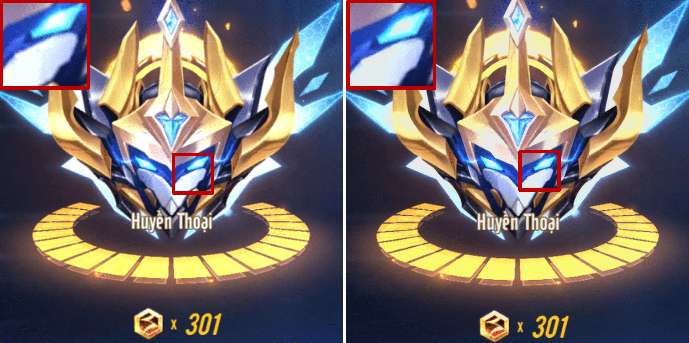

# [Pytorch] Super-Resolution CNN

Implementation of SRCNN model in **Image Super-Resolution using Deep Convolutional Network** paper with Pytorch.

Tensorflow version: https://github.com/Nhat-Thanh/SRCNN-TF

I used Adam with optimize tuned hyperparameters instead of SGD + Momentum. 

I implemented 3 models in the paper, SRCNN-915, SRCNN-935, SRCNN-955.


## Contents
- [Train](#train)
- [Test](#test)
- [Demo](#demo)
- [Evaluate](#evaluate)
- [References](#references)


## Train
You run this command to begin the training:
```
python train.py  --steps=300000                    \
                 --architecture="915"       \
                 --batch_size=128           \
                 --save-best-only=0         \
                 --save-every=1000          \
                 --save-log=0               \
                 --ckpt-dir="checkpoint/x2" 
```
- **--save-best-only**: if it's equal to **0**, model weights will be saved every **save-every** steps.
- **--save-log**: if it's equal to **1**, **train loss, train metric, validation loss, validation metric** will be saved every **save-every** steps.


**NOTE**: if you want to re-train a new model, you should delete all files in sub-directories in **checkpoint** directory. Your checkpoint will be saved when above command finishs and can be used for the next times, so you can train a model on Google Colab without taking care of GPU time limit.

I trained 3 models on Google Colab in 300000 steps: 
[](https://colab.research.google.com/github/Nhat-Thanh/SRCNN-Pytorch/blob/main/SRCNN-Pytorch.ipynb)

You can get the models here:
- [SRCNN-915.pt](checkpoint/SRCNN915/SRCNN-915.pt)
- [SRCNN-935.pt](checkpoint/SRCNN935/SRCNN-935.pt)
- [SRCNN-955.pt](checkpoint/SRCNN955/SRCNN-955.pt)


## Test
I use **Set5** as the test set. After Training, you can test models with scale factors **x2, x3, x4**, the result is calculated by compute average PSNR of all images.
```
python test.py --scale=2 --architecture=915 --ckpt-path="default"
```
- **--ckpt-path="default"** means you are using default model path, aka **checkpoint/SRCNN{architecture}/SRCNN-{architecture}.h5**. If you want to use your trained model, you can pass yours to **--ckpt-path**.

## Demo 
After Training, you can test models with this command, the result is the **sr.png**.
```
python demo.py --image-path="dataset/test1.png" \
               --architecture="915"             \
               --ckpt-path="default"            \
               --scale=2
```
- **--ckpt-path** is the same as in [Test](#test)

## Evaluate

I evaluated models with Set5, Set14, BSD100 and Urban100 dataset by PSNR:

<div align="center">

|   Model   | Set5 x2 | Set5 x3 | Set5 x4 | Set14 x2 | Set14 x3 | Set14 x4 | BSD100 x2 | BSD100 x3 | BSD100 x4 | Urban100 x2 | Urban100 x4 |
|:---------:|:-------:|:-------:|:-------:|:--------:|:--------:|:--------:|:---------:|:---------:|:---------:|:-----------:|:-----------:|
| SRCNN-915 | 37.2598 |	34.2887 | 32.0071 |	33.7201  | 31.3065  | 29.5828  |  33.4726  |  31.1328  |  29.6973  |   30.3163   |   26.8897   |
| SRCNN-935	| 37.1797 |	34.2977 | 31.9799 |	33.6997  | 31.2851  | 29.5513  |  33.4816  |  31.1014  |  29.6568  |   30.3186   |   26.8634   |
| SRCNN-955	| 36.7996 | 34.2977 | 32.1393 |	33.4307  | 31.4633  | 29.6675  |  33.3674  |  31.1648  |  29.6832  |   30.2185   |   26.9614   |

</div>

<div align="center">
    
  <p><strong>Bicubic x2 (left), SRCNN-955 x2 (right).</strong></p>
</div>
Source: game ZingSpeed Mobile

## References
- Image Super-Resolution Using Deep Convolutional Networks: https://arxiv.org/abs/1501.00092
- SRCNN Matlab code: http://mmlab.ie.cuhk.edu.hk/projects/SRCNN.html
- T91: http://vllab.ucmerced.edu/wlai24/LapSRN/results/SR_training_datasets.zip
- Set5: https://filebox.ece.vt.edu/~jbhuang/project/selfexsr/Set5_SR.zip
- Set14: https://filebox.ece.vt.edu/~jbhuang/project/selfexsr/Set14_SR.zip
- BSD100: https://filebox.ece.vt.edu/~jbhuang/project/selfexsr/BSD100_SR.zip
- Urban100: https://filebox.ece.vt.edu/~jbhuang/project/selfexsr/Urban100_SR.zip
